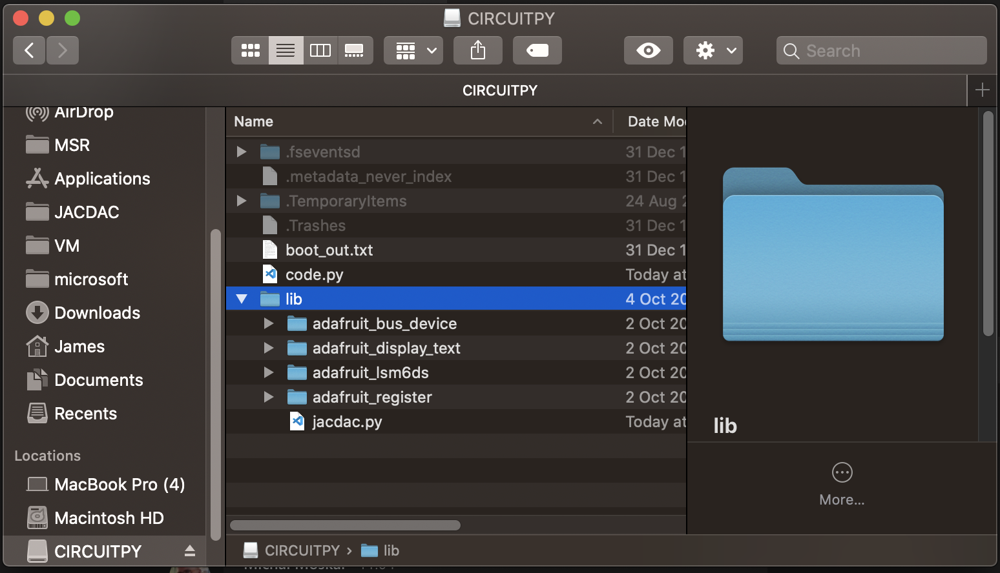

# JACDAC CircuitPython

This repository implements JACDAC in CircuitPython. Read more about JACDAC at [jacdac.org](https://jacdac.org).

## Usage

```py
from jacdac import JDStack
import board
import time

jd = JDStack(board.P12)

while True:
    # other app code
    jd.process()
    time.sleep(.1)
```

Above is the most minimal program to operate the JACDAC stack. `process()` must be called regularly to process received packets and to regularly send advertisements from your device. In the sample above, `process()` is called every 100 milliseconds, though the time between calls to process is tuned depending on bus activity and application demands.

For example, if your program is hosting the accelerometer service, `process()` will need to be called at least every 10 milliseconds. The accelerometer service may be configured to stream packets every 10 milliseconds, which defines the minimum `process()` call speed:

```py
from jacdac import JDStack, JDAccelerometer
import time
import adafruit_lsm6ds.lsm6ds33
import board

jd = JDStack(board.P12)
i2c = board.I2C()
accelerometer = adafruit_lsm6ds.lsm6ds33.LSM6DS33(i2c)
jd_accel = JDAccelerometer(accelerometer, jd)
jd.add_service(jd_accel)


while True:
    # other app code
    jd.process()
    time.sleep(.01)
```

## Installation

Currently, JACDAC is not merged into mainline CircuitPython and only works on NRF52-based boards. A JACDAC-enabled uf2 CircuitPython file for the Adafruit Clue is provided in the samples folder. You will have to compile CircuitPython for other NRF52-based boards.

To build a JACDAC CircuitPython binary:

1. clone https://github.com/jamesadevine/circuitpython and checkout the `jacdac` branch.
2. `git submodule init && git submodule sync && git submodule update`
3. `cd ports/nrf`
4. `make BOARD=<your board> -j 10`. For instance to build for clue the command would be: `make BOARD=clue_nrf52840_express -j 10`. The list of boards can be found in `ports/nrf/boards`

To use the JACDAC stack in your CircuitPython program simply copy jacdac.py to the `libs` folder on the CIRCUITPY drive. For some of the samples contained in this repository, additional libraries are also required:

* `adafruit_bus_device`
* `adafruit_lsm6ds`
* `adafruit_display_text`
* `adafruit_register`

The latest versions of these libraries can be obtained from the [Adafruit CircuitPython Bundle](https://github.com/adafruit/Adafruit_CircuitPython_Bundle/). After installation the CIRCUITPY drive should look like:



# Contributing

This project welcomes contributions and suggestions.  Most contributions require you to agree to a
Contributor License Agreement (CLA) declaring that you have the right to, and actually do, grant us
the rights to use your contribution. For details, visit https://cla.opensource.microsoft.com.

When you submit a pull request, a CLA bot will automatically determine whether you need to provide
a CLA and decorate the PR appropriately (e.g., status check, comment). Simply follow the instructions
provided by the bot. You will only need to do this once across all repos using our CLA.

This project has adopted the [Microsoft Open Source Code of Conduct](https://opensource.microsoft.com/codeofconduct/).
For more information see the [Code of Conduct FAQ](https://opensource.microsoft.com/codeofconduct/faq/) or
contact [opencode@microsoft.com](mailto:opencode@microsoft.com) with any additional questions or comments.
